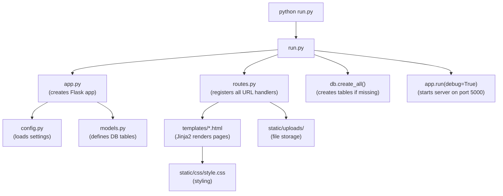
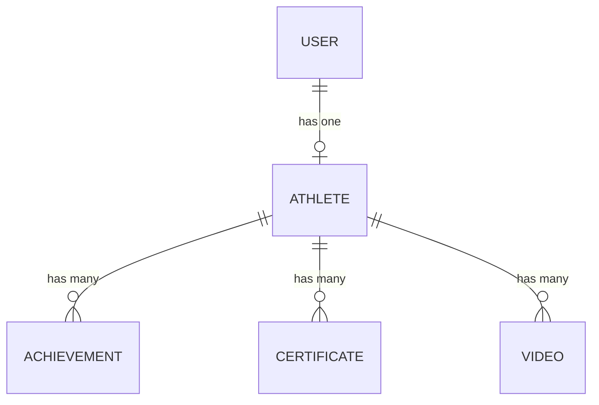
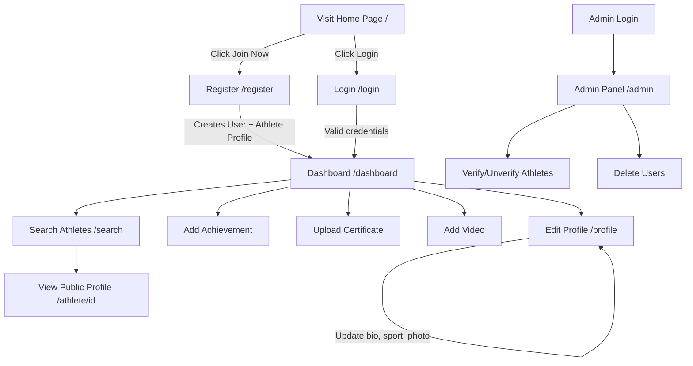

# 🏟️ Sportsdin — Complete Project Analysis

> **Project Path:** `C:\Users\Divyanshu\Documents\Sportsdin- Mini Project`
> **Type:** Python Flask Web Application (College Mini Project)
> **Purpose:** A LinkedIn-style platform exclusively for athletes — build profiles, upload achievements/certificates, embed match videos, and get discovered by coaches.

---

## 📂 Full Directory Structure

```
Sportsdin- Mini Project/
│
├── run.py                  ← 🚀 ENTRY POINT — run this to start the server
├── app.py                  ← Flask app factory (creates app, db, login_manager)
├── config.py               ← Configuration (secret key, DB path, upload folder)
├── models.py               ← Database models (User, Athlete, Achievement, Certificate, Video)
├── routes.py               ← All URL routes & request handlers
├── requirements.txt        ← Python dependencies (Flask, SQLAlchemy, Flask-Login)
├── sportsdin.db            ← SQLite database file (28 KB)
│
├── static/
│   ├── css/
│   │   └── style.css       ← All custom CSS (Poppins font, blue/dark theme, cards, hero)
│   └── uploads/            ← Uploaded files land here (profile photos, certificates)
│                              Currently EMPTY — no files uploaded yet
│
├── templates/
│   ├── base.html           ← Master layout (navbar, footer, flash messages, Bootstrap 5)
│   ├── home.html           ← Landing page (hero section, features, stats band, CTA)
│   ├── about.html          ← About page (mission, who uses it, how it works)
│   ├── login.html          ← Login form (email + password)
│   ├── register.html       ← Registration form (name, email, password, role picker)
│   ├── dashboard.html      ← After-login home (profile card + 4 quick-action tiles)
│   ├── profile.html        ← Full editable profile (bio, sport, achievements, certs, videos)
│   ├── public_profile.html ← Read-only view of any athlete's profile
│   ├── search.html         ← Search athletes (by name, sport, location)
│   ├── admin.html          ← Admin panel (stats, user table, verify/delete actions)
│   ├── add_achievement.html← Form to add an achievement
│   ├── add_video.html      ← Form to add a YouTube video link
│   ├── upload_certificate.html ← Form to upload a certificate file
│   └── includes/           ← Sub-directory (currently EMPTY)
│
├── PROJECT_CONTENT.md.txt  ← Project documentation file
├── PROJECT_PROGRESS.md     ← Progress tracking file
└── __pycache__/            ← Python bytecode cache (auto-generated, ignore)
```

---

## ⚙️ How the Files Connect (Execution Flow)



### Step-by-step:
1. **`run.py`** — You run this. It imports `app` and `db` from `app.py`, imports `routes.py` (which registers all URL handlers), creates DB tables, and starts the Flask dev server.
2. **`app.py`** — Creates the Flask app object, initializes SQLAlchemy (database) and Flask-Login (session auth). Loads settings from `config.py`.
3. **`config.py`** — Stores the secret key, database file path (`sportsdin.db`), upload folder path, and pagination settings.
4. **`models.py`** — Defines 5 database tables (see below).
5. **`routes.py`** — Contains ALL the URL routes (home, login, register, profile, admin, etc.) and their logic.
6. **`templates/`** — Jinja2 HTML templates. `base.html` is the master layout; every other page extends it.
7. **`static/`** — CSS and uploaded files (profile photos, certificates).

---

## 🗄️ Database — Complete Breakdown

**Database File:** `sportsdin.db` (SQLite, located in the project root)
**ORM:** Flask-SQLAlchemy

### Tables & Schemas

#### 1. `user` — Login & Authentication (1 row currently)
| Column | Type | Constraints | Description |
|---|---|---|---|
| `id` | INTEGER | PRIMARY KEY, NOT NULL | Auto-increment user ID |
| `email` | VARCHAR(120) | UNIQUE, NOT NULL | Login email |
| `password` | VARCHAR(120) | NOT NULL | **Hashed** password (scrypt via Werkzeug) |
| `name` | VARCHAR(100) | NOT NULL | Full display name |
| `role` | VARCHAR(20) | Default: `'athlete'` | `'athlete'`, `'coach'`, or `'admin'` |
| `created_at` | DATETIME | Default: current timestamp | Account creation time |

#### 2. `athlete` — Sports Profile (0 rows currently)
| Column | Type | Constraints | Description |
|---|---|---|---|
| `id` | INTEGER | PRIMARY KEY | Profile ID |
| `user_id` | INTEGER | FK → `user.id`, NOT NULL | Links to the user |
| `bio` | TEXT | Nullable | About / bio text |
| `sport` | VARCHAR(50) | Nullable | e.g., "Football", "Cricket" |
| `location` | VARCHAR(100) | Nullable | City / region |
| `website` | VARCHAR(200) | Nullable | Personal website URL |
| `profile_image` | VARCHAR(200) | Nullable | Filename of uploaded photo |
| `is_verified` | BOOLEAN | Default: False | Admin can toggle this |
| `created_at` | DATETIME | Auto | Profile creation time |

#### 3. `achievement` — Sports Achievements (0 rows)
| Column | Type | Constraints | Description |
|---|---|---|---|
| `id` | INTEGER | PRIMARY KEY | Achievement ID |
| `athlete_id` | INTEGER | FK → `athlete.id`, NOT NULL | Belongs to which athlete |
| `title` | VARCHAR(100) | NOT NULL | Achievement name |
| `description` | TEXT | Nullable | Details |
| `date` | VARCHAR(50) | Nullable | When (e.g., "June 2024") |
| `created_at` | DATETIME | Auto | Record creation time |

#### 4. `certificate` — Uploaded Certificate Files (0 rows)
| Column | Type | Constraints | Description |
|---|---|---|---|
| `id` | INTEGER | PRIMARY KEY | Certificate ID |
| `athlete_id` | INTEGER | FK → `athlete.id`, NOT NULL | Belongs to which athlete |
| `title` | VARCHAR(100) | NOT NULL | Certificate name |
| `file_path` | VARCHAR(200) | NOT NULL | Path like `uploads/filename.pdf` |
| `issued_date` | VARCHAR(50) | Nullable | Issue date |
| `created_at` | DATETIME | Auto | Upload time |

#### 5. `video` — YouTube Match Videos (0 rows)
| Column | Type | Constraints | Description |
|---|---|---|---|
| `id` | INTEGER | PRIMARY KEY | Video ID |
| `athlete_id` | INTEGER | FK → `athlete.id`, NOT NULL | Belongs to which athlete |
| `youtube_id` | VARCHAR(50) | Nullable | YouTube video ID (extracted from URL) |
| `title` | VARCHAR(100) | Nullable | Video title |
| `description` | TEXT | Nullable | Video description |
| `created_at` | DATETIME | Auto | Record creation time |

### Table Relationships



- One **User** → one **Athlete** profile (only if role is `athlete`, coaches don't get one)
- One **Athlete** → many **Achievements**, **Certificates**, **Videos**
- Cascade delete: deleting a User deletes their Athlete profile, which deletes all their achievements, certificates, and videos

---

## 🔐 Passwords & Authentication

### How Passwords Work
| Aspect | Detail |
|---|---|
| **Hashing** | `werkzeug.security.generate_password_hash()` — uses **scrypt** algorithm |
| **Verification** | `werkzeug.security.check_password_hash()` |
| **Storage** | Stored as a long hash string in `user.password` column |
| **Recoverable?** | ❌ NO — one-way hash, original password **cannot** be retrieved |
| **Session** | Flask-Login manages sessions via cookies |

### Current Users in Database

| ID | Email | Name | Role | Created |
|---|---|---|---|---|
| 1 | `divyanshu2819@gmail.com` | DIVYANSHU TIWARI | **admin** | 2026-08-21 21:06:34 |

> **Note:** This is the ONLY user. The admin account has **no athlete profile** (0 rows in athlete table). The password is hashed and cannot be read back. The uploads folder is also empty — no files have been uploaded yet.

### How to Reset Admin Password
Run this from the project folder:
```powershell
python -c "from app import app, db; from models import User; from werkzeug.security import generate_password_hash; ctx = app.app_context(); ctx.push(); u = User.query.filter_by(email='divyanshu2819@gmail.com').first(); u.password = generate_password_hash('YOUR_NEW_PASSWORD'); db.session.commit(); print('Done'); ctx.pop()"
```
Replace `YOUR_NEW_PASSWORD` with whatever you want.

---

## 🌐 All URL Routes (Pages & Actions)

| Route | Method | Auth? | What It Does |
|---|---|---|---|
| `/` | GET | No | Landing page (home.html) |
| `/about` | GET | No | About page |
| `/register` | GET/POST | No | Registration form → creates User + Athlete profile |
| `/login` | GET/POST | No | Login form → checks hashed password |
| `/logout` | GET | Yes | Ends session, redirects to home |
| `/dashboard` | GET | Yes | Dashboard with profile card + quick actions |
| `/profile` | GET | Yes | Full editable profile page |
| `/update_profile` | POST | Yes | Saves bio, sport, location, photo changes |
| `/achievements/add` | GET/POST | Yes | Add a new achievement |
| `/achievements/delete/<id>` | GET | Yes | Delete your own achievement |
| `/certificates/upload` | GET/POST | Yes | Upload a certificate (PDF/PNG/JPG) |
| `/videos/add` | GET/POST | Yes | Add a YouTube video link |
| `/search` | GET | No | Search athletes by name, sport, location |
| `/athlete/<id>` | GET | Yes | View any athlete's public profile (read-only) |
| `/admin` | GET | Admin | Admin panel — stats + user management table |
| `/admin/verify/<user_id>` | GET | Admin | Toggle athlete verification badge |
| `/admin/delete_user/<user_id>` | GET | Admin | Delete a user and ALL their data |

### User Roles
| Role | Can Access | Set Via |
|---|---|---|
| `athlete` | Dashboard, Profile, Search, Add content | Registration form (default) |
| `coach` | Dashboard, Search | Registration form (select "Coach") |
| `admin` | Everything + Admin Panel | Manually set in database (no UI to assign) |

> ⚠️ There is **no way to create an admin from the UI**. The admin role must be set directly in the database.

---

## 🎨 Frontend Stack

| Component | Technology |
|---|---|
| **CSS Framework** | Bootstrap 5.3.2 (CDN) |
| **Icons** | Bootstrap Icons 1.11.3 (CDN) |
| **Custom CSS** | `static/css/style.css` (314 lines) |
| **Font** | Google Fonts — **Poppins** (300–800 weight) |
| **Templating** | Jinja2 (Flask's built-in) |
| **JavaScript** | Bootstrap JS only (no custom JS) |

### Design Theme (CSS Variables)
```css
--sd-blue:   #0a66c2   /* Primary blue (LinkedIn-ish) */
--sd-dark:   #0b1f3a   /* Dark navy */
--sd-navy:   #12305e   /* Medium navy */
--sd-grey:   #6b7280   /* Muted text */
--sd-light:  #f4f6f8   /* Page background */
--sd-border: #e3e7ec   /* Card borders */
```

### Key CSS Classes
| Class | What It Styles |
|---|---|
| `.sd-navbar` | Top navigation bar (white, sticky) |
| `.sd-hero` | Hero banner (dark-to-blue gradient) |
| `.btn-sd` | Primary blue rounded button |
| `.btn-sd-light` | Transparent ghost button (for hero) |
| `.sd-card` | Content cards (white, rounded, hover lift) |
| `.sd-profile-cover` | Blue gradient cover photo on profile/dashboard |
| `.sd-avatar` | Circular profile image (130px) |
| `.sd-avatar-placeholder` | Letter avatar when no photo uploaded |
| `.sd-badge-soft` | Soft blue pill badge |
| `.sd-footer` | Dark footer |
| `.auth-wrapper` / `.auth-card` / `.auth-side` | Login/register split layout |
| `.sd-stats` | Dark stats band section on home page |

---

## 📦 Dependencies

From `requirements.txt`:
```
Flask==3.0.0              # Web framework
Flask-SQLAlchemy==3.1.1   # Database ORM
Flask-Login==0.6.3        # User session management
```
Werkzeug is included with Flask (used for password hashing and file uploads).

---

## 🚀 How to Run

```powershell
# 1. Navigate to project
cd "C:\Users\Divyanshu\Documents\Sportsdin- Mini Project"

# 2. Install dependencies
pip install -r requirements.txt

# 3. Start the server
python run.py
```

Server starts at → **http://127.0.0.1:5000**

---

## 🔑 Key Config Settings

From `config.py`:

| Setting | Value |
|---|---|
| `SECRET_KEY` | `'sportsdin-college-project-2026'` |
| `SQLALCHEMY_DATABASE_URI` | `sqlite:///sportsdin.db` (in project root) |
| `UPLOAD_FOLDER` | `static/uploads/` |
| `ATHLETES_PER_PAGE` | 10 |

---

## 📊 Current Database State (Live Snapshot)

| Table | Rows | Status |
|---|---|---|
| `user` | **1** | Only the admin account exists |
| `athlete` | **0** | Admin has no athlete profile |
| `achievement` | **0** | Empty |
| `certificate` | **0** | Empty |
| `video` | **0** | Empty |

The `static/uploads/` folder is also **empty** — no files have been uploaded yet.

---

## 🧭 Application Flow (User Journey)



---

## ⚠️ Things to Note

1. **No admin creation from UI** — The only way to make someone an admin is by directly changing their `role` in the database.
2. **No password reset feature** — If you forget your password, you need to reset it via Python/SQLite directly.
3. **No email verification** — Users can register with any email.
4. **File uploads** — Only PDF, PNG, JPG allowed for certificates. Profile photos accept any image. All go to `static/uploads/`.
5. **YouTube videos** — Only YouTube links are supported. The app extracts the video ID from the URL.
6. **Debug mode** — The server runs with `debug=True`, which auto-reloads on code changes but should NOT be used in production.
